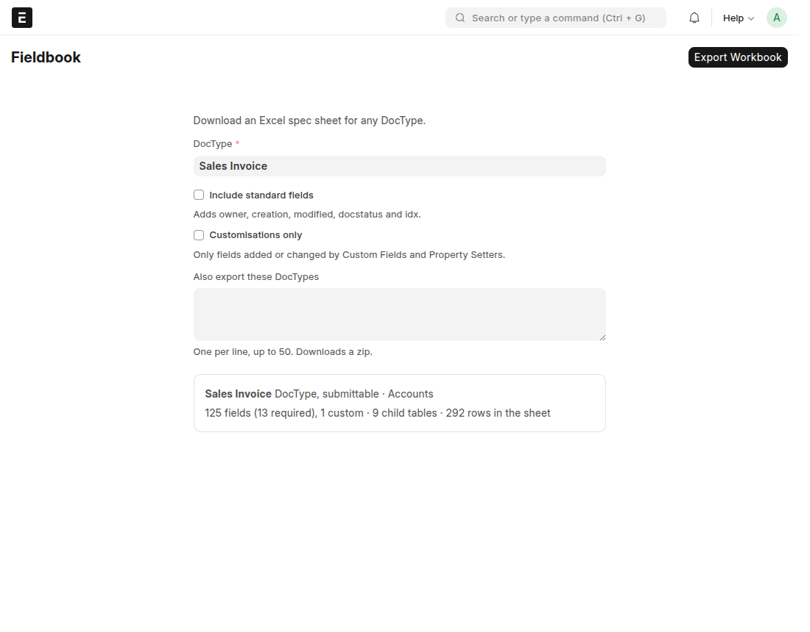

<p align="center"></p>

## Fieldbook

Download an Excel spec sheet for any DocType in Frappe Desk, custom ones included.

Built for the moment you have to tell someone else what a DocType looks like on **your** site: the
vendor building an API integration, a client signing off a data model, an auditor. Frappe's import
template lists a DocType's columns for importing data; Fieldbook documents it for people who have to
build against it: types, required rules and descriptions, plus a ready-to-use example payload and a
JSON Schema, with your custom fields included.



Open **Fieldbook** (`/app/fieldbook` on Frappe 15, `/desk/fieldbook` on Frappe 16; System Manager
only), choose a DocType, check the preview and click **Export Workbook**. The file has three sheets:

1. **The DocType's name**: every field with its database type, whether it is required, a
   description and an example. Child tables follow their table row as `field (child: DocType)`.
2. **Payload**: an example record as JSON, with child tables nested as arrays.
3. **Schema**: a JSON Schema (draft 2020-12) for that payload.

Everything is read live from the DocType metadata and the database, so the file is always current.
The app stores nothing: there are no tables or records behind it, and examples are synthetic, never
real data. See [PRIVACY.md](PRIVACY.md).

### Options

- **Include standard fields** adds the columns the system maintains: `owner`, `creation`, `modified`,
  `modified_by`, `docstatus` and `idx` for the document, and `parent`, `parentfield`, `parenttype` and
  `idx` for child rows. They come last in each block and are never required. `docstatus` is limited to
  0, 1, 2 for submittable DocTypes and to 0 otherwise.
- **Customisations only** lists just the fields that a Custom Field or a Property Setter added or
  changed. A custom DocType is listed in full. This means everything that differs from the DocType as
  its app ships it, so it also shows changes that ERPNext's own settings make (for example the
  rounding options).
- **Also export these DocTypes** (one per line, at most 50) downloads a zip with one workbook per
  DocType and an `_Index.xlsx` summarising them. The options above apply to all of them.

### What to expect

- Fields are ordered required first, then optional, each in DocType order. Hidden, layout, virtual
  and column-less fields are left out on purpose: they hold no data in the database, so they have
  nothing to put in a payload.
- **Required** is `Yes`, `No` or `Conditional` (mandatory only when another field says so; the
  Description says when). Rules enforced in code rather than in the DocType cannot be detected.
- **Description** combines the label, link and select hints, Frappe's own help text, and whether the
  field is read only, fetched from another field, unique, or has a default. Custom fields say whether
  an app or a person added them; the app is named only when Frappe recorded it.
- **Examples** are chosen so a whole record reads sensibly (nothing paid yet, quantity times rate
  equals the total, due dates after posting dates). Currency, country and language come from the
  site's own settings.
- **Schema** carries `enum` for Select fields, `format` for dates and emails, and `maxLength`.
- **Version stamp.** The Schema sheet says when the file was generated and from which Frappe and app
  versions and database engine (in `description` and a machine-readable `x-generated-from`), so a
  reader knows which site version it describes. It contains no site name, company or user.
- **Data types are what your database reports.** They vary with the database engine and the Frappe
  version, and so can the fields themselves: for example `Sales Invoice.customer` is required in
  Frappe 16 but not in 15. Each file records which version it came from.
- **Preview and errors.** The preview numbers come from the same code that builds the file. Problems
  (unknown DocType, no access, server or connection failure) appear as a message on the page.

### Compatibility

| | Status |
|---|---|
| Frappe / ERPNext 15, MariaDB | Tested: unit tests (CI and locally), a run over every DocType of a test site in all option combinations, and the page in a browser |
| Frappe / ERPNext 16, MariaDB | Tested: CI runs the unit tests on 15 and 16 with ERPNext and MariaDB |
| Frappe 16, SQLite, without ERPNext | Tested: unit tests, a run over every DocType in all option combinations, and the page in a browser (one test run, not in CI) |
| Frappe 14 | Not tested |
| Postgres | Not tested. Column types fall back to Frappe's own table description |

CI is the `.github/workflows` pair: `ci.yml` (tests on 15 and 16) and `linter.yml` (style, Semgrep
rules, dependency audit).

### Install

```bash
bench get-app https://github.com/s1dharthpv/fieldbook
bench --site <site> install-app fieldbook
```

### Development

```bash
bench --site <site> set-config allow_tests true
bench --site <site> run-tests --app fieldbook
```

Most tests use ERPNext DocTypes, so install ERPNext on the test site; on a Frappe-only site those are
skipped and the rest still run. Code style is checked with `ruff`, `prettier` and `eslint` (see
`.pre-commit-config.yaml`), and CI also runs Frappe's Semgrep rules.

### Contributing

`main` is the stable branch (what the Marketplace installs). Work happens on `develop`; open a pull
request into `main`, and CI and the linters must pass. Report bugs on the
[issue tracker](https://github.com/s1dharthpv/fieldbook/issues) and security problems as described in
[SECURITY.md](SECURITY.md). Release notes are in [CHANGELOG.md](CHANGELOG.md).

#### License

MIT
